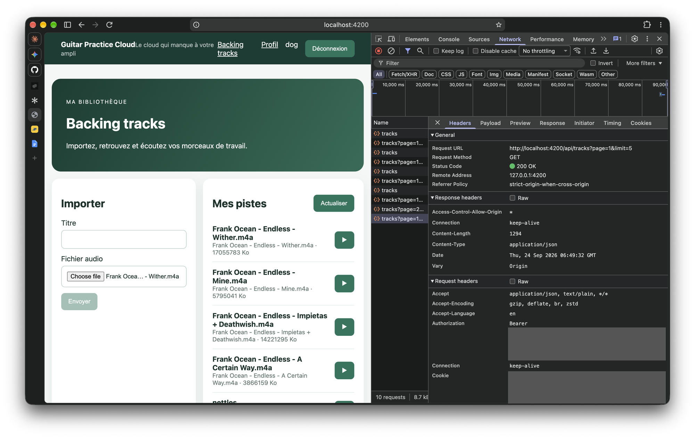
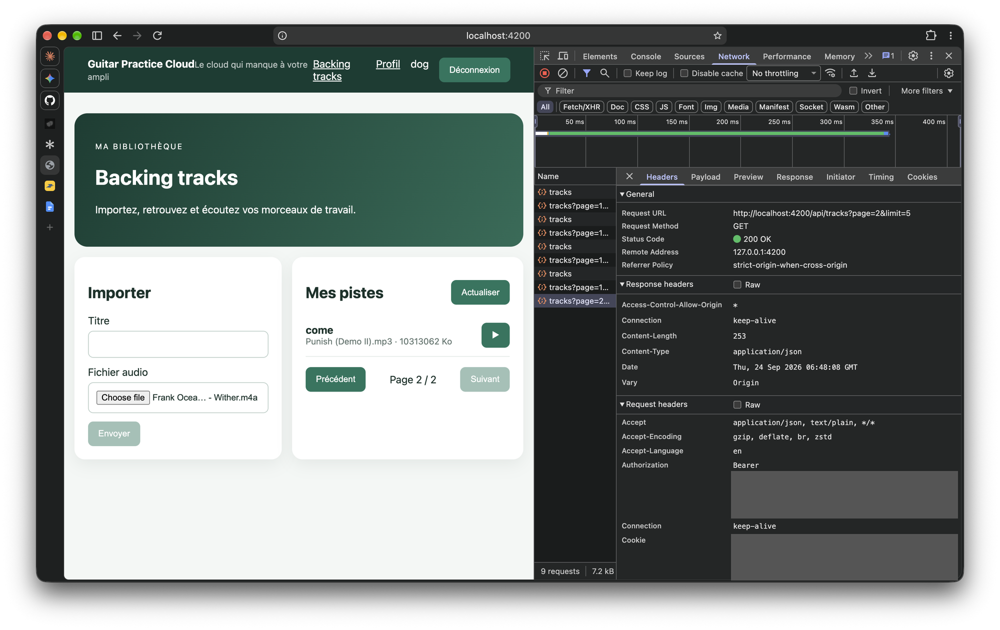

# Rapport d'usage de l'IA

# TP1

Pour chaque mission, détailler et fournir des explications concernant : objectif; prompt principal; plan proposé par l'agent; vérifications réalisées par le binôme; erreurs ou propositions rejetées; fichiers effectivement modifiés; preuve de fonctionnement; ce que chaque membre sait maintenant expliquer sans l'agent.

Préparation obligatoire avant la séance

_Prompt pour mongo db en local :_ there is this assignement but I want to run mongo db in local instead with docker compose can you do the thing for the projet to use local mogo db but don't update the assigment

_Prompt pour completer le compose et usiliser bun :_ yes make the compose launch the whole app front back + bd : and use bun insead of node

## Mission 1 — Inscription, Connexion et Profil

_Objectif, prompt principal, plan, vérifications, erreurs rejetées, fichiers modifiés, ce que chaque membre sait expliquer : à compléter par le binôme._

Preuves Network (JWT et mot de passe caviardés avant capture) :

- [Connexion réussie — `POST /api/auth/login` → `200 OK`](screenshots/tp1-mission1/network-login-succes-200.png)
- [Connexion refusée — `POST /api/auth/login` → `401 Unauthorized`](screenshots/tp1-mission1/network-login-refuse-401.png)
- [`GET /api/users/me` sans token → `401 {"message":"Authentification requise"}`](screenshots/tp1-mission1/users-me-401-sans-token.png)

Capture manquante à ajouter : une requête `/api/users/me` **authentifiée** (avec en-tête `Authorization` visible), pour couvrir le 3e point du Checkpoint ("lecture ou modification de `/api/users/me`").

Migration de express vers le framework hono et restructuration du backend :
"is hono better or elysia (with bun chosed already)"
"and keeping express?"
gader express a été déconseillé par claude notament pour la sécurité de types offerte par les autres alternatives
"can you migrate all the backend to hono (with ts)"
la migration s'est faite avec une spec puis un plan d'implemenation

# TP2 — Bibliothèque, upload et lecture audio

Prompts de départ :

- « Commence SUJET_ETUDIANT_TP2.md et dis moi ce que je dois faire pour compléter le RAPPORT_IA_MODELE.md »
- « ok commence point par point et dis moi ce que je dois faire de mon côté »

## Mission 2 — Bibliothèque paginée

**Objectif.** Afficher les pistes de l'utilisateur page par page, avec une nouvelle requête `GET /api/tracks?page=…&limit=…` à chaque changement de page. Il est interdit de tout récupérer puis de découper la liste dans Angular.

**Plan proposé par l'agent.**

1. Constat sur l'existant : `TrackService.list(page, limit)` transmettait déjà `page` et `limit` via `HttpParams`. Le composant avait les signals `tracks`, `page`, `pages` et `loading`, et le template utilisait déjà `@for` / `@empty` / `@if`.
2. Ce qui manquait : un signal `error` affiché dans le template, des boutons « Précédent » / « Suivant » (libellés complets) désactivés aux bornes _et_ pendant un chargement, et une garde dans `go()` contre une page hors bornes.
3. Écrire d'abord des tests (vitest + `HttpTestingController`), les voir échouer, puis implémenter.

**Flux.**

```text
TracksPageComponent.go(n) → page.set(n) → load()
  → TrackService.list(page(), limit) → HttpClient.get('/api/tracks', { params: { page, limit } })
  → GET /api/tracks?page=n&limit=5 → { items, page, limit, total, pages }
  → tracks.set(items), pages.set(pages), loading.set(false)
```

Côté backend (`backend/src/routes/tracks.ts`, route `GET /`), `page` et `limit` sont bornés (page ≥ 1, 1 ≤ limit ≤ 20), puis la page est lue avec `skip((page - 1) * limit).limit(limit)` et le total avec `countDocuments`, les deux en parallèle.

**Fichiers modifiés.**

- `frontend-starter/src/app/components/tracks-page/tracks-page.ts` : signal `error`, constante `limit`, garde dans `go()`, `messageOf()` qui lit le `{ message }` renvoyé par le backend.
- `frontend-starter/src/app/components/tracks-page/tracks-page.html` : message d'erreur `role="alert"`, boutons « Précédent » / « Suivant ».
- `frontend-starter/src/app/components/tracks-page/tracks-page.spec.ts` (nouveau) : 5 tests (page 1 + limit 5 au démarrage, `page=2` au clic sur Suivant, boutons désactivés aux bornes, état vide, erreur affichée).

**Vérifications.**

- Tests automatisés : `npm test` → 17/17 tests passent, dont les 5 nouveaux.
- Vérification manuelle : 6 pistes uploadées, soit 2 pages. Dans l'onglet Network, chaque clic sur « Précédent » / « Suivant » déclenche une nouvelle requête avec le bon paramètre `page`, et « Suivant » est désactivé sur la dernière page (captures ci-dessous).

**Preuve Network.**

JWT et cookie caviardés avant capture.

- [Page 1 — `GET /api/tracks?page=1&limit=5` → `200 OK`](screenshots/tp2-mission2/network-page-1.png)
- [Page 2 — `GET /api/tracks?page=2&limit=5` → `200 OK`, « Page 2 / 2 », bouton « Suivant » désactivé](screenshots/tp2-mission2/network-page-2.png)





**Propositions rejetées / erreurs de l'IA.** _À COMPLÉTER par le binôme (ou « aucune » si c'est le cas)._

**Options avancées.** Paginator Angular Material : réalisé (voir la section suivante). Les boutons « Précédent » / « Suivant » et la méthode `go()` décrits plus haut ont été remplacés par `mat-paginator`. `aggregate-paginate-v2` : non réalisé.

**Ce que chaque membre sait maintenant expliquer sans l'agent.** _À COMPLÉTER par chaque membre, avec ses propres mots (pourquoi la pagination serveur, rôle de chaque signal, comment `HttpParams` construit la query string, à quoi servent `skip` et `limit` côté Mongo)._

Avancé utilisation de angular material :

prompts  "angular marerial et fait des maquetes pour avoir un truc jolié"
"fait des trucs plus pro et travaillés"
"implemente le A studio"

Avancé Pagination Mongoose :
