# Rapport d'usage de l'IA

# TP1

Pour chaque mission, détailler et fournir des explications concernant : objectif; prompt principal; plan proposé par l'agent; vérifications réalisées par le binôme; erreurs ou propositions rejetées; fichiers effectivement modifiés; preuve de fonctionnement; ce que chaque membre sait maintenant expliquer sans l'agent.

Préparation obligatoire avant la séance

_Prompt pour mongo db en local :_ there is this assignement but I want to run mongo db in local instead with docker compose can you do the thing for the projet to use local mogo db but don't update the assigment

_Prompt pour completer le compose et usiliser bun :_ yes make the compose launch the whole app front back + bd : and use bun insead of node

## Mission 1 - Inscription, Connexion et Profil

_Objectif, prompt principal, plan, vérifications, erreurs rejetées, fichiers modifiés, ce que chaque membre sait expliquer : à compléter par le binôme._

Preuves Network :

- [Connexion réussie - `POST /api/auth/login` → `200 OK`](screenshots/tp1-mission1/network-login-succes-200.png)
- [Connexion refusée - `POST /api/auth/login` → `401 Unauthorized`](screenshots/tp1-mission1/network-login-refuse-401.png)
- [`GET /api/users/me` sans token → `401 {"message":"Authentification requise"}`](screenshots/tp1-mission1/users-me-401-sans-token.png)

Capture manquante à ajouter : une requête `/api/users/me` **authentifiée** (avec en-tête `Authorization` visible), pour couvrir le 3e point du Checkpoint ("lecture ou modification de `/api/users/me`").

Migration de express vers le framework hono et restructuration du backend :
"is hono better or elysia (with bun chosed already)"
"and keeping express?"
gader express a été déconseillé par claude notament pour la sécurité de types offerte par les autres alternatives
"can you migrate all the backend to hono (with ts)"
la migration s'est faite avec une spec puis un plan d'implemenation

# TP2 - Bibliothèque, upload et lecture audio

Prompts de départ :

- « Commence SUJET_ETUDIANT_TP2.md et dis moi ce que je dois faire pour compléter le RAPPORT_IA_MODELE.md »
- « ok commence point par point et dis moi ce que je dois faire de mon côté »

1. Constat sur l'existant : `TrackService.list(page, limit)` transmettait déjà `page` et `limit` via `HttpParams`. Le composant avait les signals `tracks`, `page`, `pages` et `loading`, et le template utilisait déjà `@for` / `@empty` / `@if`.
2. Ce qui manquait : un signal `error` affiché dans le template, des boutons « Précédent » / « Suivant » (libellés complets) désactivés aux bornes _et_ pendant un chargement, et une garde dans `go()` contre une page hors bornes.
3. Écrire d'abord des tests (vitest + `HttpTestingController`), les voir échouer, puis implémenter.

JWT et cookie caviardés avant capture.

- [Page 1 - `GET /api/tracks?page=1&limit=5` → `200 OK`](screenshots/tp2-mission2/network-page-1.png)
- [Page 2 - `GET /api/tracks?page=2&limit=5` → `200 OK`, « Page 2 / 2 », bouton « Suivant » désactivé](screenshots/tp2-mission2/network-page-2.png)

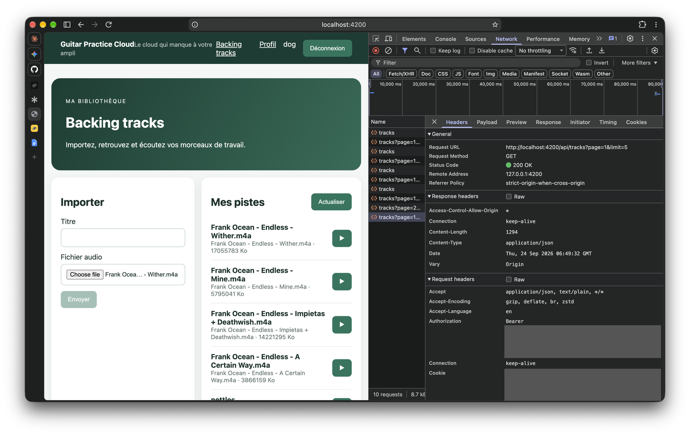

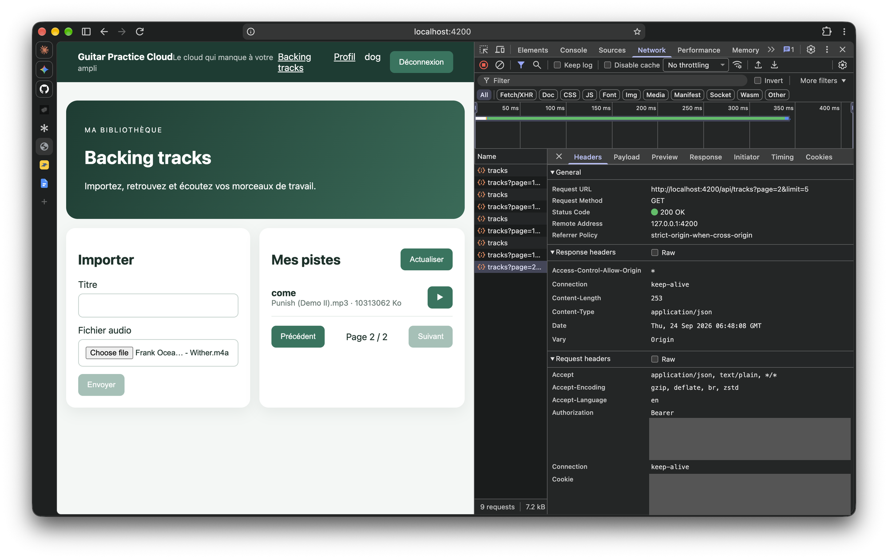

**Options avancées.** Paginator Angular Material : réalisé (voir la section suivante). Les boutons « Précédent » / « Suivant » et la méthode `go()` décrits plus haut ont été remplacés par `mat-paginator`. `aggregate-paginate-v2` : non réalisé.

**Ce que chaque membre sait maintenant expliquer sans l'agent.** _À COMPLÉTER par chaque membre, avec ses propres mots (pourquoi la pagination serveur, rôle de chaque signal, comment `HttpParams` construit la query string, à quoi servent `skip` et `limit` côté Mongo)._

Avancé utilisation de angular material :

prompts  "angular marerial et fait des maquetes pour avoir un truc jolié"
"fait des trucs plus pro et travaillés"
"implemente le A studio"

Avancé Pagination Mongoose :
 fait ça stp : Pagination Mongoose

feature simple

L'agent a ajouté le plugin `mongoose-aggregate-paginate-v2` sur le modèle `Track` et `GET /api/tracks` appelle maintenant `Track.aggregatePaginate(pipeline, { page, limit })`. Une seule agrégation donne la page et le total. Le plugin renvoie ses propres noms (`docs`, `totalDocs`...), on les a remis en `items`, `total`, `pages` comme avant et on a juste ajouté `hasPrevPage`, `hasNextPage`, `prevPage`, `nextPage` et `pagingCounter`. Comme ça le front n'a pas cassé. `API_CONTRACT.md` est mis à jour.

Avancé image de couverture :

"## AVANCÉ - Image de couverture je vuex faire ça comment je dois faire on passe par les métadaté des fichers est ce qu'il faut ffmpeg?"
"mais y'a aussi des alac et flac et ça marche pas :"
"comment je dois faire propose une spec"
"et comment les metadoées sont résupérées? c'est avec ffmpeg?"
"mais y'a moyen de garder la pochette en converissent an flac avec ffmpeg :/"

L'agent a dit qu'il ne fallait pas ffmpeg pour les métadonnées : la librairie `music-metadata` lit directement les tags (ID3 pour le MP3, les atomes MP4 pour le m4a, les blocs FLAC) et la pochette intégrée. On n'a pris que la pochette du fichier, pas d'upload d'image ni de recherche sur le web (MusicBrainz / Cover Art Archive), donc pas de souci de droits sur les images. On garde `artist` et `album`, et le tag `title` sert de titre si on n'en tape pas.

Le problème c'était mes `.m4a` : ils sont en ALAC, et Chrome et Firefox ne savent pas le lire (« Lecture impossible »), seul Safari y arrive. Et le FLAC était refusé en 400 parce que `audio/flac` n'était pas dans la liste. Là ffmpeg sert, mais seulement pour convertir l'ALAC en FLAC à l'upload (sans perte, 0,4 s pour 22 Mo). Pour la pochette, l'agent a trouvé que ffmpeg la voit comme un flux vidéo, et avec `-map 0:v? -c:v copy -disposition:v attached_pic` elle est gardée dans le FLAC. On a aussi monté la limite à 100 Mo.

Côté API : nouveaux champs `artist`, `album`, `hasCover` sur la piste et une route `GET /api/tracks/:id/cover` avec JWT, qui répond 404 si la piste est à un autre. Le front la récupère en `Blob` comme l'audio. Tout est dans la spec `docs/superpowers/specs/2026-09-24-media-metadata-covers-design.md`.

## Mission 3 - Upload et lecture audio

Prompts :

"est ce q'uil y a des trucs a faire encore deans le tp2"
"ok Le rapport de la Mission 3 fai ça stp"
"c'est trop long et structuré ça fait pas naturel"
"il manque quoi ? je dois rajouter le bare d'upload du ficher?"

L'agent m'a dit que la barre existait déjà et qu'il manquait surtout les captures Network. Pour les faire :

"je dois montrer quoi?"
"je peux même pas selectionner les fichiers pas audio" → l'input a un `accept`, il faut glisser le fichier ou passer par curl pour avoir la vraie 400 du back
"ça a pas marché" → j'avais fait `set TOKEN=...` en zsh donc le token était vide et j'ai eu une 401
pour le 404 le compte intrus existait déjà, il a fallu faire un login au lieu d'un register

L'upload et la lecture étaient déjà dans le starter, on a surtout ajouté la validation du fichier avant l'envoi (`validateAudioFile()` dans `audio-file.ts`), la barre de progression, le bouton bloqué pendant l'envoi, les messages d'erreur et de succès, le retour à la page 1 et les cards. On a aussi fait la suppression et le filtre par titre.

Pour l'upload, `TrackService.upload()` construit un `FormData` avec `audio` et `title` et l'envoie en POST. Le back revérifie tout dans `validateAudio()` (fichier présent, format, taille) et renvoie une 400 sinon. On vérifie aussi côté front pour que l'utilisateur ait le message tout de suite, mais ça ne suffit pas : n'importe qui peut envoyer une requête avec curl. On a monté la limite à 100 Mo parce qu'un FLAC fait vite 40 Mo.

Pour la lecture, `play()` récupère le fichier avec `HttpClient` en `responseType: 'blob'`, l'intercepteur ajoute le JWT, puis on crée une URL avec `URL.createObjectURL()` qu'on donne au `<audio>`.
On ne peut pas mettre directement l'URL de l'API dans `src` parce que c'est le navigateur qui fait la requête et pas Angular, donc pas d'intercepteur et pas de token (on obtient une 401). L'ancienne URL est révoquée à chaque nouveau morceau et quand on quitte la page.

Questions :

- Le back n'envoie pas tout en mémoire, `file.stream()` lit le fichier sur le disque par morceaux.
- Avec `responseType: "blob"` le composant reçoit le fichier seulement quand il est entièrement téléchargé.
- Non, la liste ne charge que les infos des pistes (5 par page), l'audio est demandé seulement au clic dans `play()`.
- Avec 100 `<audio>` et des URL HTTP, le navigateur pourrait précharger les 100 fichiers, mais il ferait du vrai buffering (lecture qui commence avant la fin du téléchargement). Et chez nous ça ne marcherait pas sans token.
- Il faut révoquer l'URL sinon le Blob reste en mémoire jusqu'à la fermeture de l'onglet.

Captures (JWT et cookie caviardés) :

Upload : le POST `tracks` répond 201 puis la liste est rechargée en page 1.

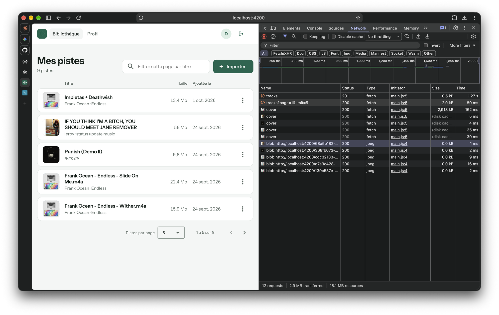

Fichier pas audio : le front bloque, le bouton Importer est désactivé et aucune requête ne part.

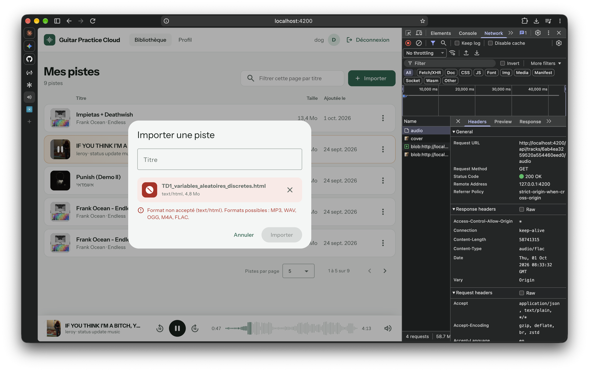

Le même fichier envoyé avec curl pour contourner le front : le back répond 400.

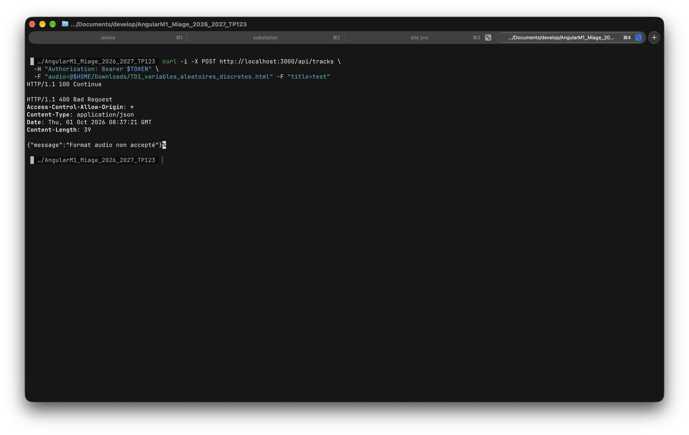

Lecture : la requête `audio` envoie le header `Authorization` et la réponse est en `audio/flac`.

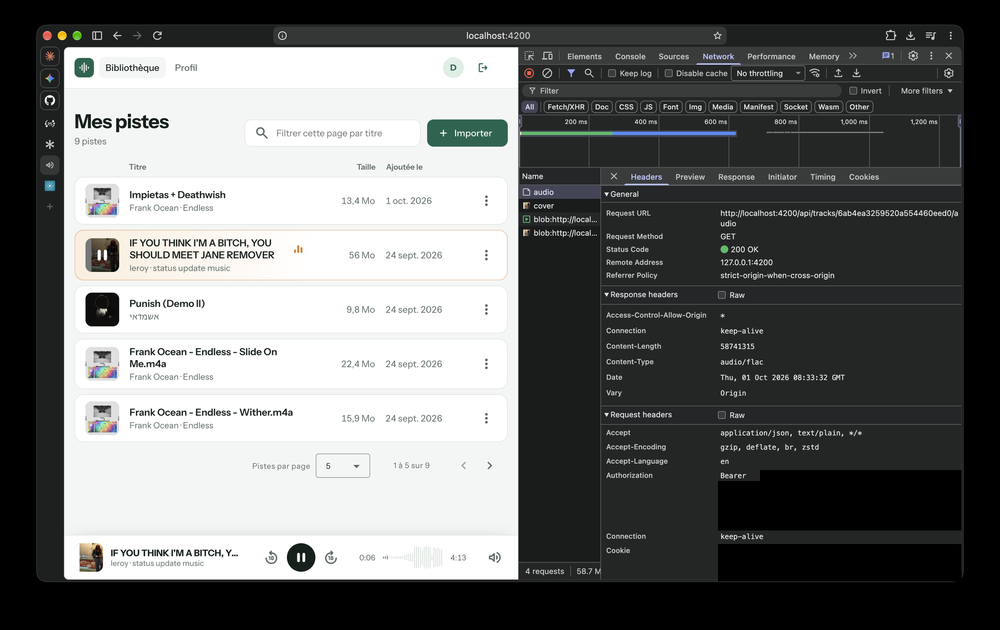

On voit le fichier téléchargé en entier par `HttpClient` (14 Mo), puis le `<audio>` qui lit l'URL `blob:` en local (206, 0 kB sur le réseau).

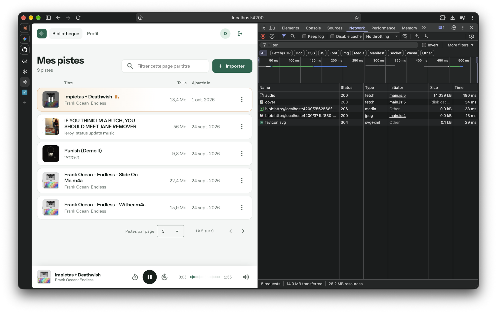

Avec le token d'un autre compte, l'audio d'une de mes pistes répond 404 (pas 401 donc le token est valide, c'est le filtre sur `ownerId` qui bloque).

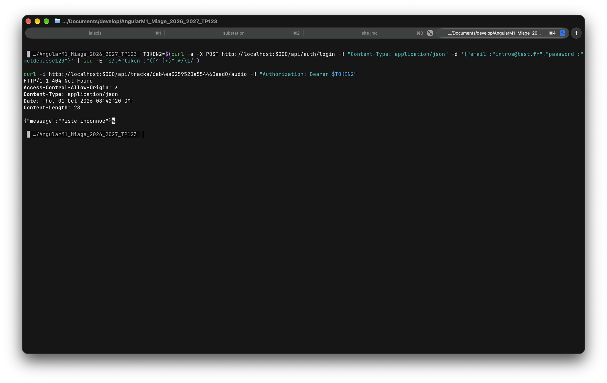

## En plus - pistes publiques et privées

"on peut rajouter une foction pour filter mes ficher et les fichies des autres pour avec une notion de ficher public et privé?"

L'agent a dit que ça change le modèle, l'API et le front donc il fallait passer par une spec comme pour les pochettes. Il a aussi fait remarquer que le TP2 demande qu'une piste ne soit lue que par son propriétaire, donc les pistes restent privées par défaut (sinon ma capture 404 ne veut plus rien dire).

Ses questions et mes réponses :

- Qu'est-ce qu'on peut faire avec les pistes des autres ? → A, juste les voir et les écouter
- Un filtre Tout / Mes pistes / Des autres, ou deux onglets séparés ? Il conseillait les onglets, j'ai quand même pris le filtre ("A aussi"), ça donnera un paramètre `scope` sur `GET /api/tracks`
- Où on choisit si c'est public ? → j'ai pas vraiment répondu, j'ai juste dit "ok nice donc fait l'impemnetation stp", il a pris ce qu'il conseillait : une case à l'import + "Rendre publique / privée" dans le menu de la card

Il a fait les tests d'abord (back puis front), puis le code. Côté back : un champ `visibility` sur la piste, `scope=all|mine|others` sur la liste, une route `PATCH /api/tracks/:id`, et l'audio et la pochette lisibles si la piste est publique. Sans `scope` la liste fait comme avant donc le TP2 marche pareil. On ne peut toujours pas modifier ni supprimer la piste d'un autre, même publique. `API_CONTRACT.md` est mis à jour.

"c'est un peu moche les 3 sont pas de la même taille et c'est même pas aligné" → le filtre Tout / Mes pistes / Des autres utilisait les boutons toggle de Material, chaque bouton prenait la largeur de son texte et il était sur une ligne à part. L'agent l'a refait à la main : 3 boutons de même largeur, même hauteur et même bord que la recherche, sur la même ligne que la recherche et Importer.

# TP3

"je dois fiare quoi pour le tp3" → l'agent a lu `SUJET_ETUDIANT_TP3.md` et m'a résumé les 3 missions (suppression, progression de l'upload, tests).

## Mission 5 - Suppression

"le delete est super simple a faire il faut jurste rajouter un endpoitn et le lier dans le front"

En fait l'endpoint `DELETE /api/tracks/:id` existait déjà dans le back, et le front avait déjà le bouton Supprimer, la confirmation, la snackbar et le rechargement (fait au TP2). Il manquait deux choses du sujet, l'agent les a ajoutées :

- un état "suppression en cours" : la card est grisée avec un spinner et on ne peut pas recliquer tant que le DELETE n'est pas fini ;
- le cas 404 (piste déjà supprimée dans un autre onglet ou pas à moi) : message "n'existe plus ou ne vous appartient pas" et la liste est rechargée pour faire disparaître la piste.

Pourquoi le guard ne suffit pas : il ne fait que cacher des pages dans le navigateur, n'importe qui peut envoyer un DELETE avec curl. C'est le back qui vérifie le JWT et filtre sur `ownerId`.

## Mission 6 - Progression de l'upload

"ok regarde la 6 si c'est déjà fait"

C'était déjà fait au TP2 : `observe: 'events'` + `reportProgress`, barre de progression avec le %, bouton "Envoi…" désactivé, message d'erreur du back, et la boîte se ferme avec une snackbar quand c'est réussi. Donc les 4 états (rien, en cours, réussi, échec) y sont.

Mais l'agent a trouvé un bug de ma feature public/privé : la case "Rendre publique" avait été collée dans la petite vignette du fichier (mauvais endroit dans le template). Il l'a remise sous le fichier. Il a aussi désactivé le titre et la case pendant l'envoi, le sujet demande de bloquer les contrôles, et a ajouté ça dans les tests de l'upload.

Pourquoi c'est différent d'une requête normale : on ne reçoit pas une seule réponse mais plusieurs événements (Sent, UploadProgress plusieurs fois, puis Response). Le % c'est `loaded / total * 100`.

## Mission 7 - Tests

"oui c'est des tests auto ou des test avec screnshots" → tests automatiques (Vitest, `npm test`), les réponses HTTP sont simulées avec `HttpTestingController` donc pas besoin du back ni de Mongo. Les screenshots c'est à part, pour l'onglet Network.

Il y avait déjà des tests pour la suppression, l'upload et l'erreur de la liste. L'agent a ajouté ce qui manquait dans la liste du sujet :

- `AuthService.login()` envoie `POST /api/auth/login` avec email + mot de passe et garde le token (et rien n'est gardé si 401) ;
- l'intercepteur met `Authorization: Bearer ...` quand il y a un token, et rien sinon ;
- le guard renvoie vers `/login` sans token (nouveau fichier `auth.guard.spec.ts`) ;
- suppression : un seul DELETE même avec deux clics, le cas 404 (message + liste rechargée) et une autre erreur (message du back, pas de rechargement).

66 tests passent. Pour vérifier que les tests servent à quelque chose, l'agent a enlevé exprès l'anti double clic : le test du double clic a bien échoué, puis il a remis le code.

## Captures TP3

Suppression : `DELETE /api/tracks/:id` répond `204 No Content`, juste après il y a le `GET tracks?page=1...` qui recharge la liste (8 pistes). Le header `Authorization` est bien envoyé. L'agent a remarqué que ma capture montrait le JWT en entier et des cookies, il les a masqués avant de la mettre dans le repo.

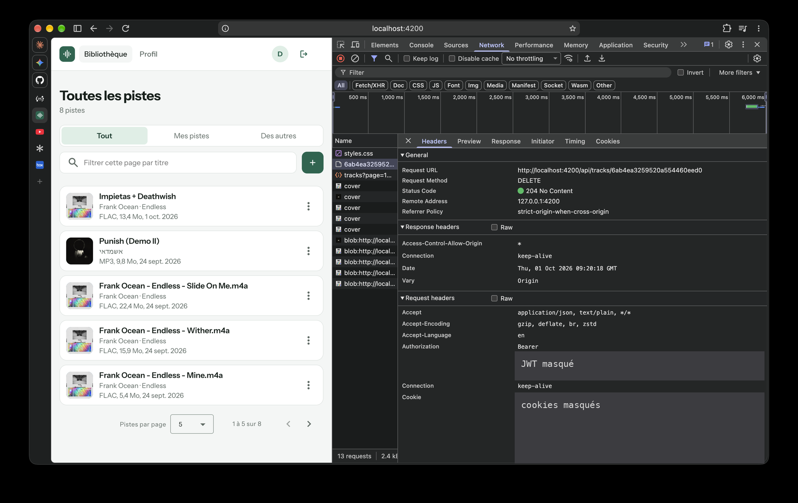

"ça c'est bon comme capture?" → ma capture de l'upload restait bloquée à 0 % et Network montrait la requête en type `fetch`. L'agent a regardé dans le code d'Angular : depuis Angular 22 `HttpClient` utilise `fetch` par défaut, et fetch ne sait pas donner la progression d'un envoi (il y a même un message dans Angular qui dit d'utiliser `withXhr()`). Il a ajouté `withXhr()` dans `main.ts`. Les tests passaient quand même avant, parce que `HttpTestingController` remplace le vrai backend : un test unitaire ne voit pas ce genre de problème, il faut tester dans le vrai navigateur.

"c'est bon l'upload marche avec la bare qui avance il commen pour ça ? 3. comment Angular calcule le pourcentage d'upload" → avec `observe: 'events'` + `reportProgress` on reçoit des événements `UploadProgress` qui donnent `loaded` et `total`, le % c'est `loaded / total * 100`. À 100 % c'est juste l'envoi qui est fini, le serveur peut encore traiter le fichier avant de répondre 201.

"faut répondre quoi ici ? ce que vérifie un test d'intercepteur ou de guard" → intercepteur : qu'il ajoute `Authorization: Bearer ...` quand il y a un token, rien sinon, et qu'un 401 déconnecte et renvoie vers `/login`. Guard : sans token il redirige vers `/login`, avec un token il laisse passer. Ça teste le comportement d'Angular, pas la sécurité, c'est le back qui vérifie vraiment le JWT.

Upload : après `withXhr()` la barre avance. Ici elle est à 100 % mais le bouton est encore sur "Envoi…" : le fichier est envoyé, le serveur est encore en train de l'analyser avant de répondre 201.

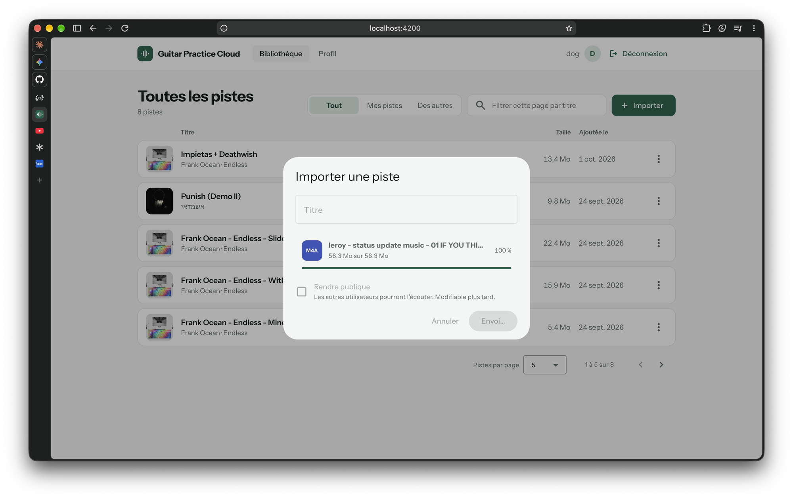

Avant / après `withXhr()` : avant la requête partait en `fetch` et restait à 0 %, après elle part en `xhr` et la barre avance jusqu'à 100 %.

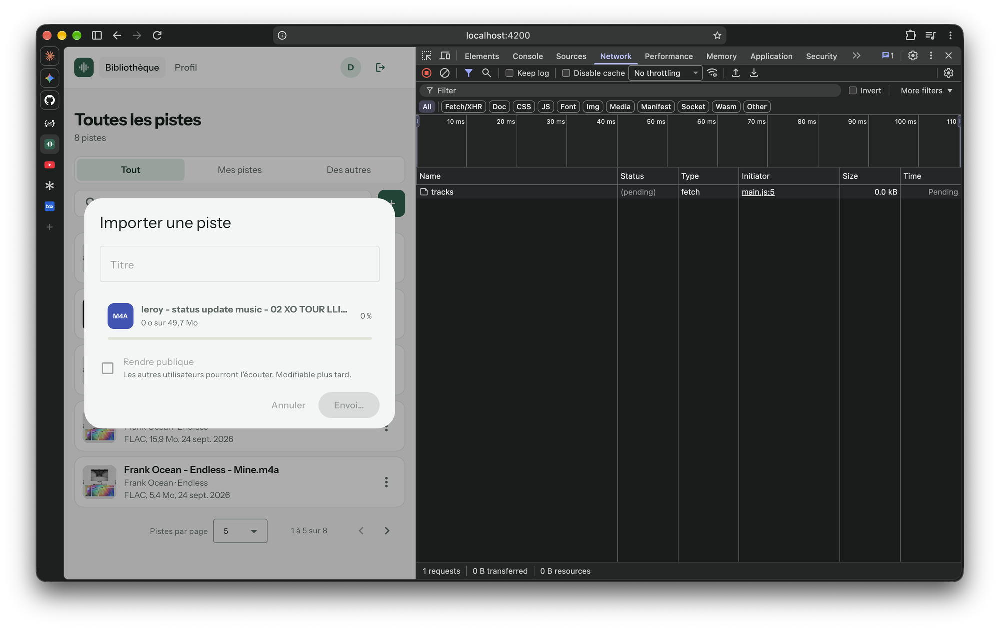

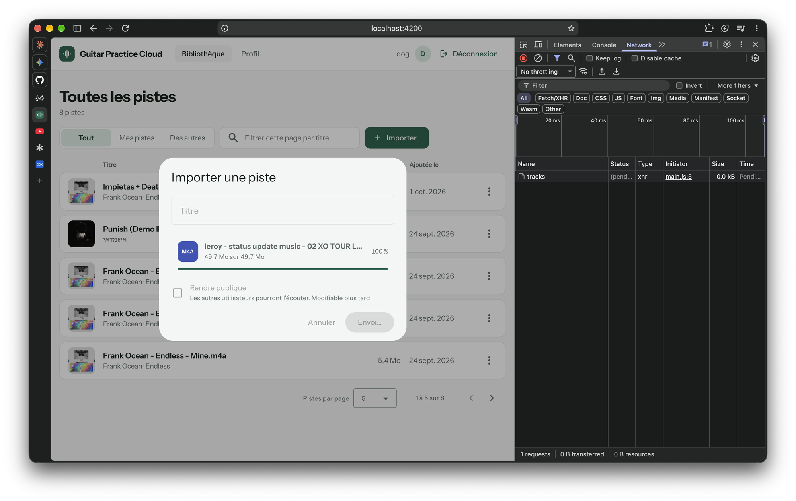

Après l'upload la liste est rechargée (`GET tracks?page=1&limit=5&scope=all`, 200) et on passe à 9 pistes. JWT et cookies masqués.

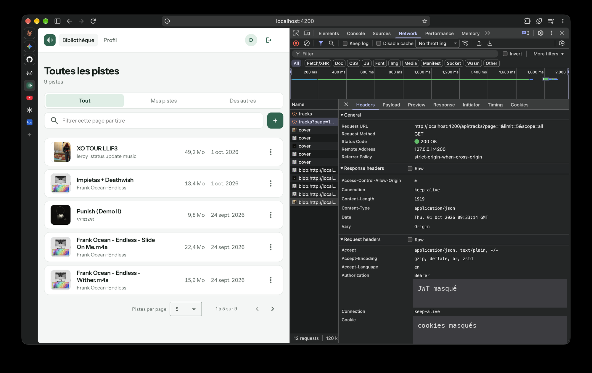

"rien dans la console" → aucune erreur. Les "33 hidden" ce sont les `console.debug` cachés par défaut, l'agent a vérifié dans le code qu'ils n'affichent que des id, des titres ou des compteurs, jamais le token ni le mot de passe.

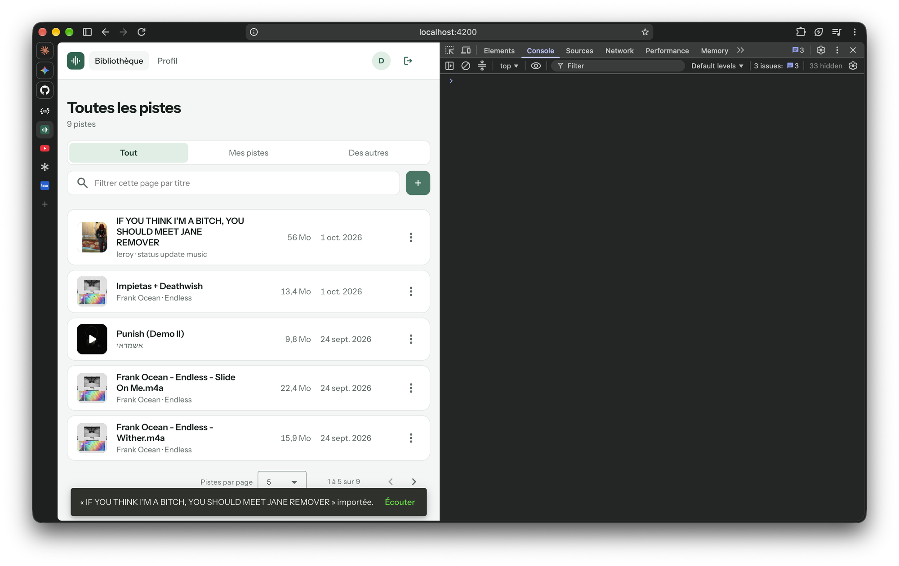

"c'est bon mtn?" → oui : `POST /api/tracks` en 201 Created, envoyé en `multipart/form-data` (`Content-Length` d'environ 52 Mo). JWT masqué.

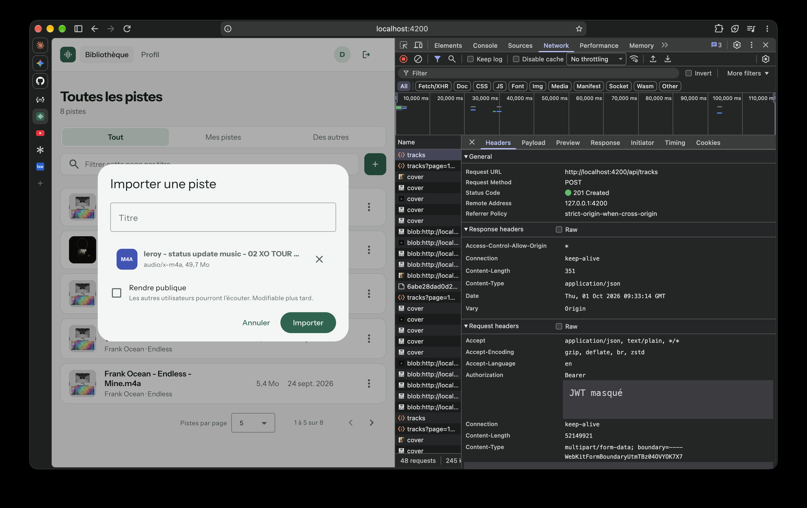

"ok fait 1 et 2" (le rapport des tests et lancer les tests back) → tests back : 116 réussis. Les tests back facultatifs du sujet existaient déjà (401 sans jeton, jeton invalide, sans fichier, MIME refusé, pagination, piste d'un autre). Le rapport des tests est dans `RAPPORT_TESTS_TP3.md`, avec attendu / observé pour chaque test.

## En plus - glisser sur la barre de lecture

"après je veur rajouter le cliquer gliser sur la bare d'anvencement de la musique style apple music"

Avant on pouvait seulement cliquer sur la forme d'onde. Maintenant on peut glisser : pendant le glissement la barre et le temps suivent la souris mais la musique continue normalement, et elle saute seulement quand on relâche (comme Apple Music). La barre grossit un peu au survol et pendant le glissement. Ça marche aussi au doigt sur mobile, et le clavier (flèches) marche toujours. L'agent a ajouté 5 tests sur le lecteur (glisser, clic simple, sortir de la barre, annulation, durée pas encore connue).

## En plus - dégradé aux couleurs de la pochette

"je veux que ce dégradé repenne la palette de la cover" (capture de la card en lecture avec le dégradé orange)

L'agent réduit la pochette à 32×32 dans un `<canvas>` une fois l'image chargée, compte les couleurs (les couleurs vives comptent plus que le gris, sinon un grand fond gris gagnerait toujours) et garde les 2 principales. Le dégradé, la bordure et les petites barres d'égaliseur prennent ces couleurs. La luminosité est bornée pour que ça reste lisible, et sans pochette on garde l'orange. Le canvas peut lire l'image parce que c'est une URL `blob:` du même site. 10 tests en plus (7 sur le calcul des couleurs, 3 sur la card).
